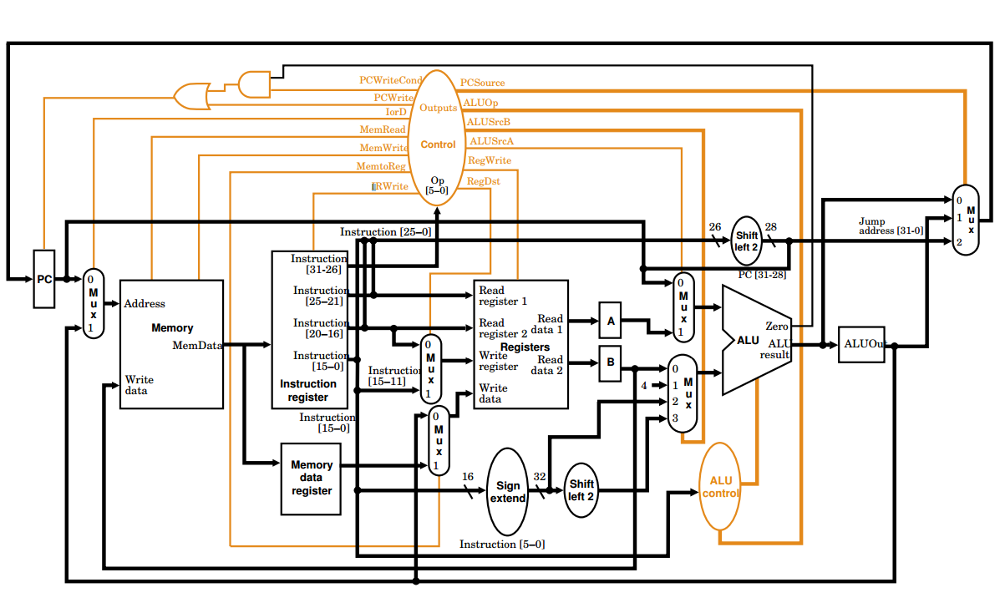
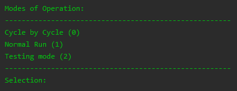

 &emsp;
 &emsp;
 &emsp;


Table of Contents
=================

* [Computer Architecture CW - MIPS Processor Simulator](#computer-architecture-cw---mips-processor-simulator)
   * [Description](#description)
   * [Functionality](#functionality)
   * [Run](#run)
   * [Final Report](#final-report)

# Computer Architecture CW - MIPS Processor Simulator 

## Description

This project is a computer engineering CW, set in second year of university. A MIPS single-instruction, multi-cycle processor simulator was created with a limited IS in C++ using the CLion IDE. It follows a straightforward IF/ID/EXE/WB/MEM cycle, which can be implemented using a state machine. 

<p align="center">
  
   <em><br />MIPS single-instruction, multi-cycle processor datapath</em>
</p>

The simulator interprets a limited set of MIPS assembly code which is read-in from a text file and translated using the **Translator** class in code. The limited MIPS IS must be chosen such that it can process a showcase program which multiplies every value from 1-99 by itself and stores it to the same register. As such, the implemented limited IS includes the following instructions:

- `beq`
- `add`
- `jr`
- `j`
- `jal` 
- `sw`
- `lw`
- `addi`

These instructions are sufficient to implement a fully functioning MIPS processor which can process the showcase program, along with leafed/non-leafed procedures and arrays.

## Functionality

The system has an automated MIPS assembly to machine code translator. The menu of the program allows the user to select from 3 different running modes. The running modes include:

0. This selection will run through the program cycle by cycle. 
1. This selection will run through the entire program and output the final values in the memory file and register file.
2. This selection will take the user to the testing suite, which tests the simulator is functioning as intended and gives a simple run-down of the simulation info, including the total number of clock cycles executed, the number of clock cycle errors (ideally 0), and the total number of instructions executed (it should be noted that this running mode will not test the users assembly code)

<p align="center">
  
   <em><br />Simulator menu</em>
</p>

The simulated processor consists of the following modules, each of which are implemented using their own class.

- ALU
- ALU Out
- Control
- Instruction Register
- Memory File
- Memory Data Register
- PC
- Register File
- Registers A and B

The job of each of the module classes is to filter inputs and carry out any operations the specific module may do. This includes multiplexer operations (implemented by switch, case statements), arithmetic, binary sorting etc. Each of these modules are called by the runInstructions function. For information regarding each instructions specific datapath and more information regarding the implementation and testing of the simulator, see the [final report](./Report.pdf). 

## Run

It should be noted that this project is **NOT** maintained. 

1. Boot-up CLion
2. Open the **CMakeLists.txt** file as a project
```
Open -> CompEngCw/CMakeLists.txt -> OK -> Open as Project
```
2. Open the **CMakeCache.txt** file as a project
```
File -> Open -> CompEngCw/cmake-build-debug/CMakeCache.txt -> OK -> Open as Project
```
3. Select the assembly program file location you want to the simulator to use in line 13 of the **Translator.cpp** file
4. Run the program
```
Method 1: Alt + Shift + F10, then press Enter on the CompEngCw config
Method 2: Run -> Run... -> press Enter on the CompEngCw config
```

## Final Report 

The report for the coursework, which includes a detailed explanation of the simulators functionality, can be found [here](./Report.pdf).